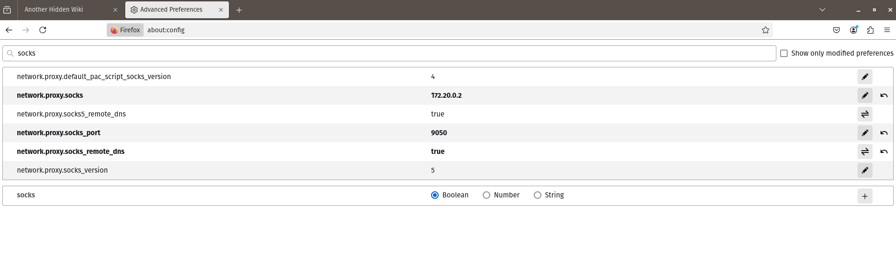
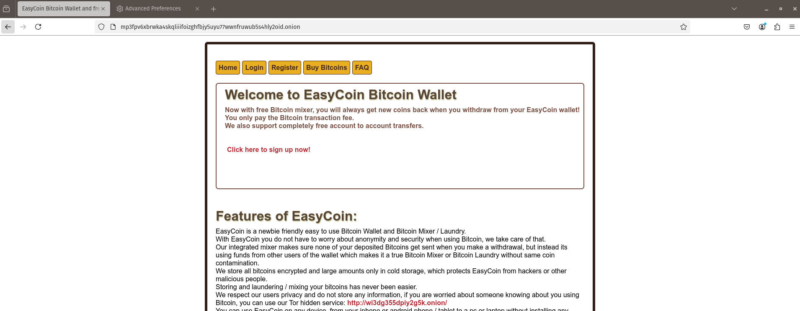
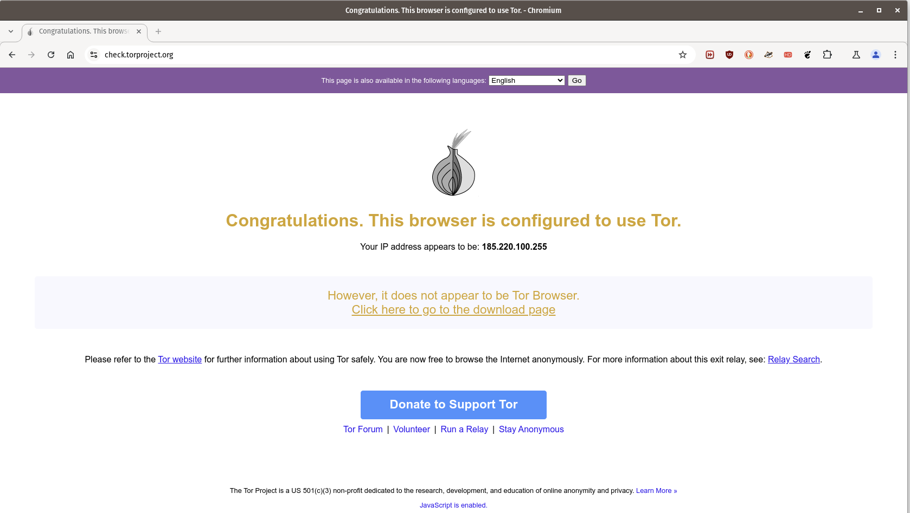
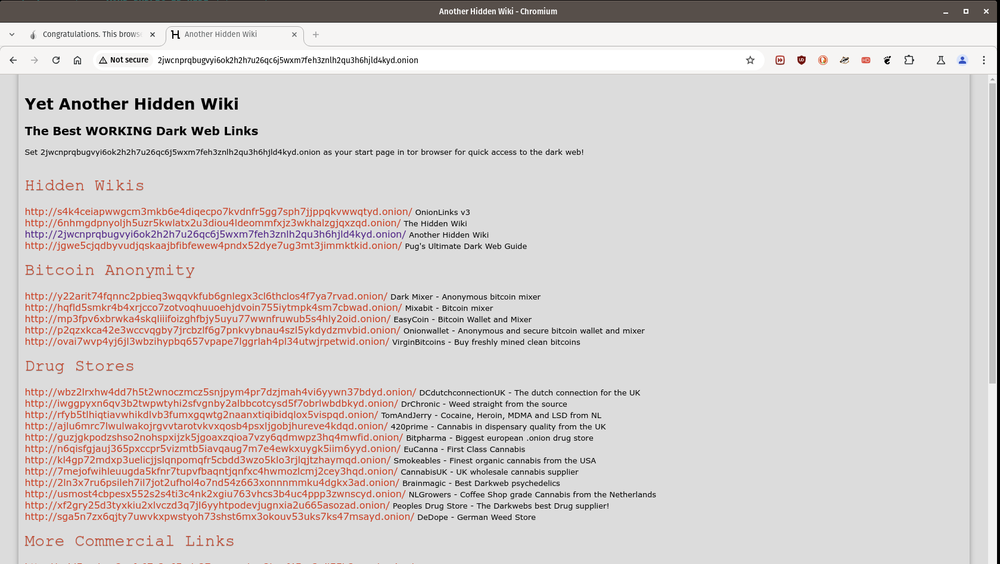

# Dockerized ToR proxy
This is a simple Dockerized Tor proxy that can be used with other containers or host applications to communicate easily through the Tor network.

The container has extraordinary in it, you probably find similar Dockerfiles somewhere else too. Or make you own using instructions found on the net or via ChatGPT.
I just packaged everything together for my own pleasure ;)

I aimed to have a smaller footprint container; hence, this one is based on Alpine.

# Obtain the docker container
## Method 1: Get the image from docker hub
```
$ sudo docker pull cslev/tor-proxy:latest
```

## Method 2: Build
 - via docker
```
$ git clone https://github.com/cslev/tor-proxy
$ sudo docker build -t cslev/tor-proxy:latest .
```
 - via docker-compose
```
$ git clone https://github.com/cslev/tor-proxy
$ sudo docker-compose build
```

# Run 
 - via docker
```
$ sudo docker run --rm --name tor-proxy -d -v ./log/tor:/var/log/tor -v ./lib/tor:/var/lib/tor cslev/tor-proxy:latest
```
 - via docker-compose
```
$ sudo docker-compose up -d
```

Check for the logs to see if the circuit is established
```
$ tail -f ./log/tor/tor.log
its in consensus, using mid) = 0% of path bw.)
Nov 14 08:18:56.000 [notice] Bootstrapped 50% (loading_descriptors): Loading relay descriptors
Nov 14 08:18:58.000 [notice] The current consensus contains exit nodes. Tor can build exit and internal paths.
Nov 14 08:18:59.000 [notice] Bootstrapped 57% (loading_descriptors): Loading relay descriptors
Nov 14 08:19:00.000 [notice] Bootstrapped 62% (loading_descriptors): Loading relay descriptors
Nov 14 08:19:01.000 [notice] Bootstrapped 70% (loading_descriptors): Loading relay descriptors
Nov 14 08:19:01.000 [notice] Bootstrapped 75% (enough_dirinfo): Loaded enough directory info to build circuits
Nov 14 08:19:02.000 [notice] Bootstrapped 90% (ap_handshake_done): Handshake finished with a relay to build circuits
Nov 14 08:19:02.000 [notice] Bootstrapped 95% (circuit_create): Establishing a Tor circuit
Nov 14 08:19:03.000 [notice] Bootstrapped 100% (done): Done
```
Once you see 100%, you are good to go.

# Control - Create a new circuit
As can be seen in the `Dockerfile`, the tor-proxy is set not to change and re-establish new circuits every time a request is sent to it.
This is set by me in an attempt to reduce the overall latency. On the other hand, remote control is enabled via the `ControlPort` directive.
The remote control is possible through Cookie-based authentication, which is generated under `/var/lib/tor/control_auth_cookie`. 
That's why we add volume to our container in the `docker run` command or in the `docker-compose.yml`; to have access to that cookie file 
(besides the logs) on the host.

We need to read that binary file as a pure hex string and provide it as an AUTH COOKIE when sending a request to the tor proxy.
To get the string:
```
$ COOKIE=$(sudo hexdump -e '32/1 "%02x""\n"' ./lib/tor/control_auth_cookie)
$ sudo echo -ne "AUTHENTICATE ${COOKIE}\r\nSIGNAL NEWNYM\r\n" | nc 172.17.0.2 9051
250 OK
250 OK
```
The last IP address is the IP address of the tor proxy container. Normally, you can just simply expose the port and send queries to the `localhost`.
If you don't know the  IP of the container, you can run [this script](https://github.com/cslev/find_veth_docker).

Alternatively, you can get the IP by inspecting the container's network like this:
```
$ sudo docker network inspect tor-proxy_default |grep IPv4Address
                "IPv4Address": "172.20.0.2/16",
```


# Use
How to test and use the tunnel? Let's check first what our IP is via `curl`:
```
$ curl  -s https://check.torproject.org |grep "<h1" -A 6
<h1 class="off">
    
      Sorry. You are not using Tor.
    
  </h1>
  <p>Your IP address appears to be:  <strong>YOUR_PUBLIC_IP_HERE</strong></p>
```

## via curl
Now, use the tor-proxy as a socks5 proxy:
```
$ curl  -s --socks5-hostname 172.20.0.2:9050  https://check.torproject.org |grep "<h1" -A 6 
  <h1 class="not">
    
      Congratulations. This browser is configured to use Tor.
    
  </h1>
  <p>Your IP address appears to be:  <strong>103.251.167.10</strong></p>
```
Normally, this also works with `.onion` links. Let's try it:
```
curl --socks5-hostname 172.20.0.2:9050 http://2jwcnprqbugvyi6ok2h2h7u26qc6j5wxm7feh3znlh2qu3h6hjld4kyd.onion/
...
[HTML]
...
```
And, it works, at least at the time of writing. `.onion` websites come and go, so try with a `.onion` link that is also working using the Tor browser.

## via Firefox
With Firefox, if we want to route traffic through the tor proxy we need to set it as a SOCKS5 proxy. Do not set it as any other proxy, e.g., HTTP/HTTPS. 
Once you opened Firefox, go to `about:config`, and type the following into the search bar:
```
socks
```
Then, you will several key-value pairs we need to set as follows 
```
network.proxy.socks = 172.20.0.2
network.proxy.socks_port = 9050
```
This only routes browsing traffic through the Tor network, but `.onion` wouldn't work as the DNS you use has no idea about them.
To force the DNS to go through the proxy too, set the following values to `true`:
```
network.proxy.socks5_remote_dns
nework.proxy.socks_remote_dns
```


Now, you can use your firefox (or potentially any browser with similar settings) to browse `.onion` sites.
For instance, below is a random `.onion` site access via Firefox.



## via Chromium
To launch chromium with the proxy, we need to provide the proxy address via a CLI argument.
```
chromium --proxy-server="socks5://172.20.0.2:9050"
```

We can also access `.onion` sites, like the hidden wiki: 

http://2jwcnprqbugvyi6ok2h2h7u26qc6j5wxm7feh3znlh2qu3h6hjld4kyd.onion/


Why is this useful? Maybe you have a plugin/extension you want to use that is only available on Chrome. But you want to use it on the darknet. This case, you need this solution
as the native Tor browser is based on Firefox. But I can have plenty of other reasons to do so.


